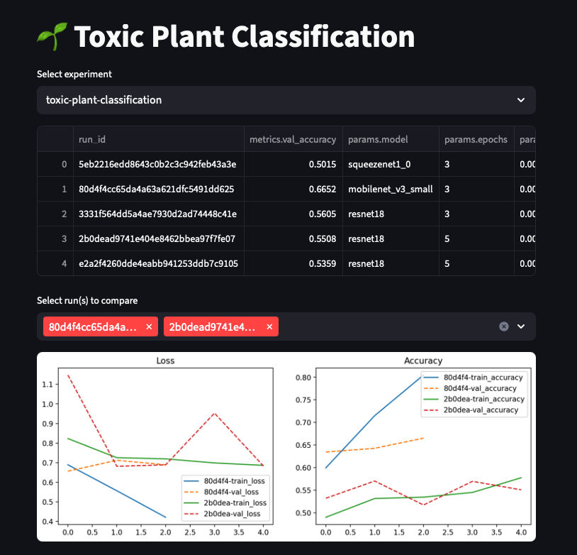
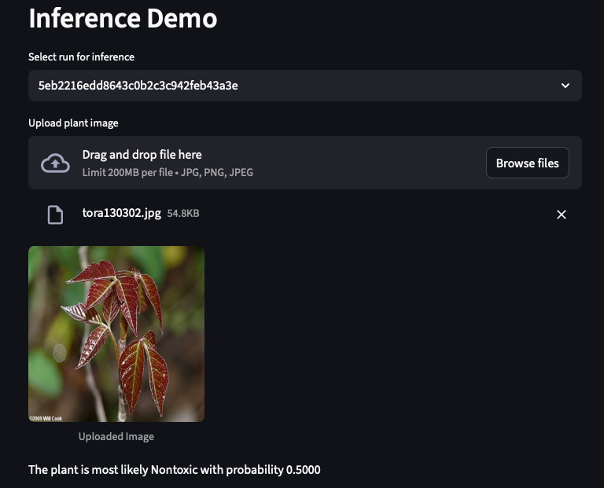

## Toxic Plant Classification 

An end-to-end **MLOps pipeline** for classifying toxic vs. non-toxic plants using PyTorch.  
This project demonstrates **data versioning (DVC)**, **experiment tracking (MLflow)**,  
and a **Streamlit dashboard** for interactive monitoring — all containerized with **Docker**.

Data downloaded from Kaggle: https://www.kaggle.com/datasets/hanselliott/toxic-plant-classification/data

## Features
- **PyTorch** training with ResNet18, MobileNetV3, and SqueezeNet
- **DVC** for reproducible preprocessing and data management
- **MLflow** for tracking hyperparameters, metrics, and models
- **Streamlit** dashboard to compare experiments
- **Dockerized** training and dashboard environments

